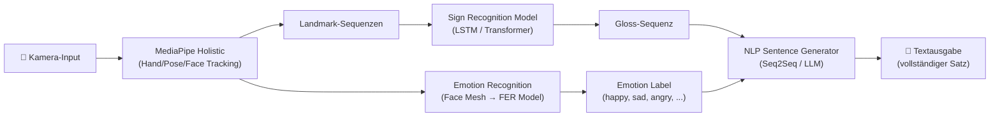
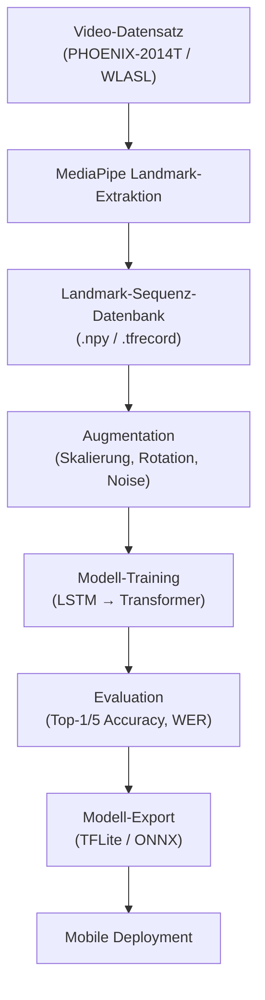
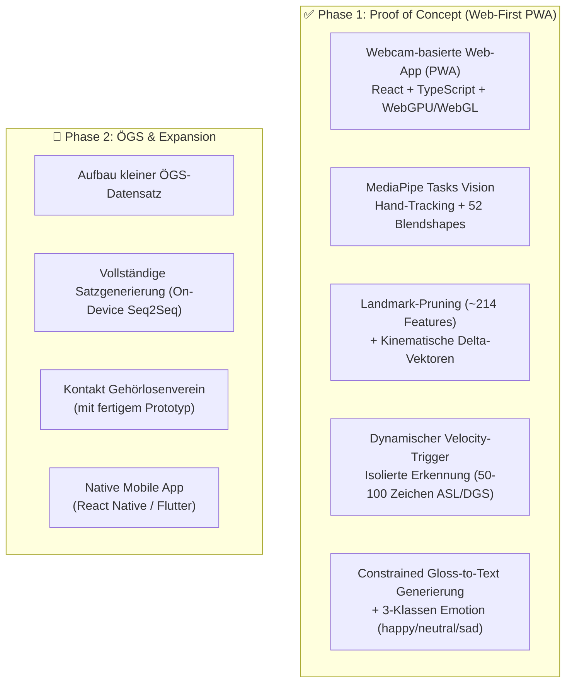

# Signy — Sign Language Translator

## Projektvorschlag / Project Proposal

**Version:** 1.0 (Draft)
**Datum:** 24. September 2026
**Projekttyp:** Schulprojekt (SYP4)

---

## 1. Zusammenfassung (Executive Summary)

**Signy** ist eine mobile Anwendung, die Gebärdensprache in Echtzeit über die Handy- oder Webcam erkennt und in vollständige, grammatikalisch korrekte Sätze übersetzt. Für eine echte **Zwei-Wege-Kommunikation** verfügt die App zudem über eine Transkriptionsfunktion (Speech-to-Text), mit der hörende Gesprächspartner per Sprache antworten können — ihr Gesprochenes wird als Text für die gehörlose Person auf dem Display visualisiert. Ein zusätzliches Emotionserkennungsmodell analysiert die Mimik der gebärdenden Person und beeinflusst die generierte Textausgabe der Gebärden — z. B. durch Tonalität, Interpunktion oder kontextuelle Anpassung.

**Zielgruppe:** Gehörlose und hörende Menschen, die miteinander kommunizieren möchten, ohne die Gebärdensprache des Gegenübers zu beherrschen.

---

## 2. Ziele

| # | Ziel | Priorität |
|---|------|-----------|
| Z1 | Erkennung von Gebärdensprache via Motion Tracking (Kamera) | Must |
| Z2 | Generierung vollständiger Sätze aus erkannten Gebärden | Must |
| Z3 | Minimale Verzögerung (< 2 Sekunden Ende-zu-Ende) | Must |
| Z4 | Emotionserkennung der gebärdenden Person | Should |
| Z5 | Einfluss der Emotionen auf die Satzbildung (Tonalität) | Should |
| Z6 | Unterstützung der Österreichischen Gebärdensprache (ÖGS) | Should |
| Z7 | Offline-Fähigkeit (On-Device-Inferenz) | Could |
| Z8 | Sprach-Transkription (Speech-to-Text) für Antworten Hörender | Must |

---

## 3. Technische Architektur

### 3.1 Systemübersicht

### 3.2 Komponentenbeschreibung

#### Komponente 1: Kamera & Vorverarbeitung
- **Input:** Live-Videofeed von Handy-Kamera oder Webcam
- **Verarbeitung:** Frame-Extraktion (30 FPS Ziel), Bildnormalisierung
- **Technologie:** Plattform-native Kamera-API (Android: CameraX, iOS: AVFoundation), alternativ Web: WebRTC

#### Komponente 2: Motion Tracking (MediaPipe Holistic / Tasks Vision)
- **Funktion:** Erkennung von 543 Landmarks (33 Pose, 468 Face Mesh + 52 Blendshapes, 21 pro Hand)
- **Output:** Normalisierte 3D-Landmark-Koordinaten pro Frame + Facial Blendshape-Koeffizienten (0.0–1.0)
- **Technologie:** [Google MediaPipe Tasks Vision API](https://ai.google.dev/edge/mediapipe/solutions/vision/hand_landmarker)
- **Performance:**
  - Moderne Mobile-SoCs (Apple A16+, Snapdragon 8 Gen 2+): **28–35 FPS** (Hand + Pose + Face, GPU-Delegate)
  - Hand Landmarker allein: **60+ FPS** (<6 ms)
  - Mid-Range (Snapdragon 700 Serie): ~15–20 FPS auf CPU, ~25 FPS mit Vulkan/OpenCL
- **Optimale Auflösung:** VGA (640 × 480) — höhere Auflösungen verschwenden CPU-Zeit ohne Genauigkeitsgewinn
- **Vorteil:** Läuft vollständig on-device, keine Cloud-Anbindung nötig

> [!TIP]
> **Optimierung 1: Landmark Dimensionality Pruning (~87% Datenreduktion)**
> Das Weiterleiten aller 543 Roh-Landmarks (1.629 Koordinaten-Floats) ist für Gebärdenerkennung ineffizient und führt zu Modell-Overfitting (die 468 Gesichts-Mesh-Punkte enthalten z.B. irrelevante Wangen- und Stirnkoordinaten).
> **Lösung:**
> - Die 468 Roh-Gesichtspunkte werden für das Gebärdenmodell komplett verworfen.
> - Verwendet werden: **42 Hand-Landmarks** (126 Floats) + **~10-12 Oberkörper-Pose-Landmarks** (Schultern, Ellbogen, Handgelenke, Nase = ~36 Floats) + **52 Gesichts-Blendshapes** (52 Floats).
> - **Ergebnis:** Input-Vektor schrumpft von 1.629 auf **~214 Floats pro Frame**! Dies beschleunigt die Transformer-Inferenz massiv, schont den Akku und verhindert thermisches Throttling.

> [!WARNING]
> **Bekannte Schwächen von MediaPipe bei Gebärdensprache:**
> 1. **Handkreuzung/Okklusion:** Wenn sich die Hände überlappen (häufig bei zweihandigen Gebärden), verliert das Tracking oft die Links/Rechts-Zuordnung
> 2. **Monokulare Tiefenambiguität:** Die Z-Achse (Hand 5 cm vs. 15 cm vor der Brust) kann aus einem einzelnen RGB-Bild nicht zuverlässig bestimmt werden
> 3. **Motion Blur:** Bei schnellen Gesten (>1,5 m/s) kollabieren Finger-Landmarks oder fallen unter den Confidence-Schwellenwert
> 4. **Modern Tasks Vision Overhead:** Da Google MediaPipe Tasks Vision Face, Hand und Pose in separate Modelle aufgeteilt hat, wird empfohlen, den Face Landmarker mit reduzierter Rate (z.B. 10–15 FPS) auszuführen, während Hand-Tracking mit vollen 30 FPS läuft.

#### Komponente 3: Sign Recognition Model
- **Input:** Sequenz von Landmark-Vektoren (beschnitten auf ~214 Features pro Frame)
- **Output:** Erkannte Gebärde (Gloss) oder Gloss-Sequenz
- **SOTA-Genauigkeit:** 85–93% Top-1 Accuracy bei 100–250 isolierten Klassen (bei 1.000+ Klassen sinkt reine Pose-Accuracy ohne multimodale Daten auf 60–75%)
- **Architektur-Optionen:**

| Ansatz | Beschreibung | Pro | Contra |
|--------|-------------|-----|--------|
| **1D-CNN + Transformer** | 1D Depthwise-Conv für lokale Dynamik + 4-Layer Transformer Encoder (Kaggle Google ISLR 1. Platz) | **State-of-the-Art**, kompakt (~12 MB), TFLite-fähig | Transformer-Wissen nötig |
| **SPOTER** | Sign Pose-based Transformer mit linguistik-basierter Normalisierung (Schulterbreite, Handgelenk-Distanz) | Invariant zu Körpergröße & Kamera-Abstand | Weniger dokumentiert |
| **LSTM/GRU** | Sequenzklassifikation auf Landmark-Zeitreihen | Einfach, bewährt, leichtgewichtig | Begrenzte Kontextlänge, nicht SOTA |
| **ST-GCN** | Spatio-Temporal Graph Convolution auf Skelett-Daten | Modelliert Skelett-Struktur explizit | Komplexeres Training |

- **Empfehlung:** **1D-CNN + Transformer Encoder** (inspiriert vom Kaggle Google ISLR-Gewinner). Kompakt genug für Mobile, deutlich besser als LSTM. LSTM nur als schneller Fallback-Prototyp.
- **Normalisierung:** Landmarks zentrieren auf Mitte der Schultern, skalieren nach Schulterbreite (körpergrößen-invariant).

> [!TIP]
> **Optimierung 2: Kinematische Delta- und Geschwindigkeitsvektoren**
> Koordinaten $(x, y, z)$ allein zeigen nur Positionen. Gebärden werden jedoch primär durch Richtungsvektoren und Beschleunigungen definiert.
> **Lösung:** An jeden Landmark-Punkt wird die 1. zeitliche Ableitung angehängt ($\Delta x_t = x_t - x_{t-1}$). Das 1D-CNN erhält dadurch sofortige Bewegungsvektoren, ohne Richtungsänderungen mühsam über mehrere Layer rekonstruieren zu müssen.

> [!TIP]
> **Optimierung 3: Dynamische Gestengrenzen-Erkennung (Motion Energy Trigger)**
> Ein starres Sliding Window (z.B. fixe 45 Frames) schneidet Gesten oft mitten in der Bewegung ab oder erfasst Pausen zwischen Gebärden (Epenthesis) als Artefakte.
> **Lösung:** Überwachung der Handgelenks-Geschwindigkeit $v_{\text{wrist}} = \sqrt{\dot{x}^2 + \dot{y}^2}$. Sinkt $v_{\text{wrist}}$ für $\ge 150\text{ ms}$ unter einen Schwellenwert $\tau$, signalisiert dies das natürliche Ende einer Gebärde. Das Modell schneidet das Intervall dynamisch aus und führt gezielt die Klassifikation aus.

- **Isolierte vs. Kontinuierliche Erkennung:**
  - **Phase 1:** Isolierte Gebärdenerkennung (einzelne Zeichen/Wörter mit dynamischem Motion-Trigger)
  - **Phase 2:** Kontinuierliche Erkennung (CTC-Loss für nicht-segmentierte Sequenzen)

> [!CAUTION]
> **The Compound Error Rate Trap:** Bei 90% Einzelwort-Accuracy sinkt die Satz-Accuracy exponentiell: 0,9⁶ ≈ **53%** für einen 6-Wort-Satz. Daher ist eine hohe Einzelwort-Genauigkeit (>95%) entscheidend, oder es muss ein Sprachmodell zur Fehlerkorrektur nachgeschaltet werden.

#### Komponente 4: Satzgenerierung (Gloss → Text)
- **Problem:** Gebärdensprache hat eine eigene Grammatik, die sich fundamental von der gesprochenen Sprache unterscheidet:
  - **Wortstellung:** DGS/ÖGS nutzen **SOV (Subjekt-Objekt-Verb)** bzw. **Topic-Comment**, Deutsch ist SVO/V2
  - **Keine Artikel/Kopulas:** „der/die/das", „ein", „sein/ist" existieren nicht in Gebärdensprache
  - **Räumliche Verbalflexion:** Pronomen werden durch Positionen im 3D-Raum (Loci) ausgedrückt
  - *Beispiel:* Glosses `GESTERN MEIN FAHRRAD JEMAND STEHLEN` → Deutsch: „Gestern wurde mein Fahrrad von jemandem gestohlen."
- **Input:** Sequenz von Glosses + Emotionslabel + Non-Manual-Marker
- **Output:** Grammatikalisch korrekter deutscher Satz

| Ansatz | Beschreibung | Pro | Contra |
|--------|-------------|-----|--------|
| **Regelbasiert** | Grammatik-Transformationsregeln | Deterministisch, erklärbar | Nicht skalierbar, brüchig |
| **mBART / Seq2Seq** | Denoising-Autoencoder (mBART-50, T5-small); Gloss→Text ist im Kern eine monolinguale Textrekonstruktions-Aufgabe | SOTA auf PHOENIX-2014T, trainierbar | Braucht Parallel-Korpus |
| **LLM-Prompting** | Gloss-Sequenz + Emotion als Prompt an LLM (Gemini Flash, etc.) | Sehr flexibel, natürliche Sprache, Few-Shot möglich | Latenz, Cloud-Abhängigkeit, Kosten |

- **Empfehlung:** **Hybridansatz** — ein kleines quantisiertes Seq2Seq-Modell (T5-small / MarianMT, ~30 MB) für schnelle On-Device-Übersetzung, mit optionalem LLM-Fallback (z. B. Gemini Flash API) für komplexe/idiomatische Sätze

> [!TIP]
> **Optimierung 4: Constrained Decoding & Halluzinations-Schutz bei LLM-Übersetzung**
> Unbeschränktes LLM-Prompting neigt dazu, Wörter hinzuzudichten oder Fakten zu halluzinieren, die nie gebärdet wurden.
> **Lösung:**
> - Sehr niedrige Temperature ($T \le 0.2$) zur Gewährleistung deterministischer Grammatikbildung.
> - Strikte Few-Shot Prompts mit Negativ-Beispielen: *„Verwende ausschließlich Bedeutungen der erkannten Glosses. Füge keine zusätzlichen Handlungen oder Personen hinzu."*
> - Bei On-Device Modellen (T5-small): Constrained Grammar Decoding / Beam Search mit festem Vokabular.
- **Ablauf (Pause-to-Translate) & Emotionsintegration:** 
  1. Hände gebärden im Fluss: Wörter werden einzeln im Puffer gesammelt (z. B. `[DU, MITKOMMEN]`).
  2. Hände ruhen kurz (~0,8s Macro-Pause): Das Satzende wird erkannt, der Token-Puffer schließt sich.
  3. Gesichtsausdruck (NMM & Emotion) liefert die syntaktische und affektive Bedeutung:
     - `Input: [DU, MITKOMMEN] | NMM: [NEUTRAL]` ➔ Output: *„Du kommst mit.“* (Einfache Aussage)
     - `Input: [DU, MITKOMMEN] | NMM: [BROW_RAISE]` (Augenbrauen hoch) ➔ Output: *„Kommst du mit?“* (Ja/Nein-Frage – Satzstellung kehrt sich um)
     - `Input: [DU, MITKOMMEN] | NMM: [HEAD_SHAKE]` (Kopfschütteln) ➔ Output: *„Du kommst nicht mit.“* (180°-Verneinung – ohne dass ein Handzeichen für „nicht“ existiert!)
     - `Input: [DU, MITKOMMEN] | Emotion: [HAPPY] | NMM: [BROW_RAISE]` ➔ Output: *„Kommst du etwa wirklich mit?!“* (Begeisterung/Einladung)

#### Komponente 5: Emotionserkennung & Non-Manual-Marker (NMM)

In der Gebärdensprache transportiert das Gesicht **zwei verschiedene Informationsebenen**, die unterschieden werden müssen:

**A) Grammatische Non-Manual-Marker (syntaktisch):**
- **Ja/Nein-Fragen:** Augenbrauen hochgezogen (`browInnerUp`), Augen geweitet, Kopf nach vorne geneigt
- **W-Fragen:** Augenbrauen zusammengezogen (`browDown`), Kopf leicht zurück
- **Negation:** Kopfschütteln + gesenkte Mundwinkel
- **Adverbiale Gesten:** Aufgeblähte Wangen (groß/viel), Zunge zwischen Zähnen (nachlässig)

**B) Affektive Emotionen (emotional):**
- Allgemeiner emotionaler Ton: Freude, Trauer, Wut, Überraschung, etc.

**Technische Umsetzung:**
- **Input:** MediaPipe **52 ARKit-Blendshape-Koeffizienten** (0.0–1.0), direkt aus dem Face Landmarker
- **Output:** Emotionslabel (7 Klassen) + NMM-Tags (Frage, Negation, etc.)
- **Mapping Blendshapes → FACS Action Units:**
  - `AU1` (Augenbrauen heben) ↔ `browInnerUp`
  - `AU4` (Augenbrauen senken) ↔ `browDownLeft/Right`
  - `AU12` (Lächeln) ↔ `mouthSmileLeft/Right`
  - `AU15` (Mundwinkel senken) ↔ `mouthFrownLeft/Right`
  - `AU26` (Kiefer öffnen) ↔ `jawOpen`

| Ansatz | Beschreibung | Größe | Latenz |
|--------|-------------|-------|--------|
| **Blendshape-MLP** (empfohlen) | 2-Layer MLP auf den 52 Blendshape-Werten | **<100 KB** | **<0,5 ms** |
| **Landmark-basiert** | Handcrafted Features (Abstände, Winkel) aus Face-Mesh | ~50 KB | <1 ms |
| **CNN auf Gesichts-Crop** | MobileNet/EfficientNet auf Gesichtsausschnitt | ~5-15 MB | ~10-20 ms |

- **Empfehlung:** **Blendshape-MLP** — nutzt die bereits vorhandenen MediaPipe-Daten, kein zusätzliches Vision-Modell nötig, extrem leichtgewichtig (<100 KB, <0,5 ms), und invariant gegenüber Beleuchtung und Hautfarbe

> [!TIP]
> Die Blendshape-Koeffizienten können auch für **einfache NMM-Erkennung per Schwellenwert** genutzt werden (ohne ML): `browInnerUp > 0.6` → potenzielle Ja/Nein-Frage. Das ist ein guter Startpunkt für den MVP.

---

## 4. Datensätze & Training

### 4.1 Verfügbare Datensätze

| Datensatz | Sprache | Typ | Umfang | Lizenz |
|-----------|---------|-----|--------|--------|
| **WLASL** | ASL | Isolierte Zeichen | ~2.000 Wörter, 21.000 Videos | Research |
| **How2Sign** | ASL | Kontinuierlich | 80h+ Video, aligned Glosses & Text | CC BY-NC 4.0 |
| **PopSign v1/v2** | ASL | Isoliert (Frontkamera) | 560 Zeichen, Mobile-spezifisch | Research |
| **PHOENIX-2014T** | DGS | Kontinuierlich | 1.066 Glosses, 8.257 Sätze mit Übersetzung | Research |
| **Public DGS Corpus** | DGS | Kontinuierlich | 50h+, 330 Signer, mit MediaPipe-Keypoints | Research |
| **SIGNUM** | DGS | Isoliert + Sätze | 450 Zeichen, 780 Sätze | Research |
| **FER2013** | — | Emotionen | 35.887 Bilder, 7 Klassen | Public |
| **AffectNet** | — | Emotionen | 450.000 Bilder | Research |

> [!IMPORTANT]
> **ÖGS ≠ DGS ≠ ASL — diese sind gegenseitig unverständlich!**
> - **ÖGS** gehört zur **französischen Gebärdensprach-Familie** (Wiener Taubstummeninstitut, 1779, gegründet nach Pariser Vorbild)
> - **DGS** gehört zu einer **eigenständigen Familie** und hat sich separat entwickelt
> - ÖGS ist seit 2005 in Österreich verfassungsrechtlich anerkannt (Art. 8 Abs. 3 B-VG)
>
> **Konkrete Strategie für ÖGS-Daten:**
> 1. **Transfer Learning:** Feature-Extraktor auf PHOENIX-2014T (DGS) oder Kaggle ISLR (ASL) vortrainieren
> 2. **Video-Wörterbuch-Harvesting:** Referenzvideos aus öffentlichen ÖGS-Wörterbüchern ([LedaSila](https://ledasila.aau.at/), [Spreadthesign](https://www.spreadthesign.com/)) extrahieren und mit MediaPipe zu Landmark-Datensätzen verarbeiten (50-100 Klassen)
> 3. **Custom Recording:** 5-10 Variationen pro Gebärde vom Projektteam aufnehmen; Augmentation (Skalierung, Translation, Tempo-Perturbation) zur Vervielfachung
> 4. **Community-Partnerschaft:** Kontakt zum **Zentrum für Gebärdensprache (ZGH, AAU Klagenfurt)** und dem **Österreichischen Gehörlosenbund (ÖGLB)** für Validierung und Co-Design

### 4.2 Trainingspipeline

---

## 5. Technologie-Stack

### 5.1 Empfohlener Stack

| Schicht | Technologie | Begründung |
|---------|-------------|------------|
| **Mobile App** | React Native / Flutter | Cross-Platform, eine Codebasis für Android & iOS |
| **Kamera** | Plattform-native Plugins | Beste Performance für Live-Video |
| **Motion Tracking** | MediaPipe (via SDK) | Google-Standard, on-device, optimiert |
| **ML Runtime** | TensorFlow Lite (TFLite) | Optimiert für Mobile, Quantisierung möglich |
| **Sign Recognition** | Custom LSTM/Transformer (Python → TFLite) | Trainiert auf Landmark-Sequenzen |
| **Satzgenerierung** | Kleines Seq2Seq-Modell (on-device) + optionales LLM-API | Hybrid für Qualität + Speed |
| **Emotionserkennung** | Lightweight Classifier auf Face-Mesh | Minimal Overhead |
| **Backend (optional)** | Firebase / Supabase | Auth, Analytics, Cloud-Fallback |
| **Training** | Python, PyTorch/TensorFlow, Google Colab | Standard ML-Tooling |

### 5.2 Entwicklungsstrategie: Web-First Prototyp (PWA) vor nativer App

Für das MVP (Phase 1) wird **ausdrücklich eine Progressive Web App (PWA)** als primäre Entwicklungsplattform empfohlen, bevor native Frameworks (React Native / Flutter) evaluiert werden:

| Aspekt | Progressive Web App (Phase 1 MVP) | Native Mobile (Phase 2 Expansion) |
|--------|-----------------------------------|-----------------------------------|
| **Kamera-Pipeline** | WebRTC / `getUserMedia` (direkte In-Memory Texturen) | CameraX / AVFoundation (plattformspezifisch) |
| **Bridge-Overhead** | **Keiner** — direkter Zugriff via WebGL / WebGPU | JS/Dart-Bridge Datenkopien kosten oft 10–15 ms |
| **Motion Tracking** | `@mediapipe/tasks-vision` (Wasm / WebGL) | MediaPipe C++ Android/iOS Wrappers |
| **ML Runtime** | `onnxruntime-web` (WebGPU) / TensorFlow.js | LiteRT / TensorFlow Lite (TFLite) |
| **Iterationsspeed** | Sofortiges Live-Reload, kein Build-Stau, DevTools Profiling | Emulatoren, Zertifikate, Native Builds |

> [!TIP]
> **Optimierung 5: Web-First vermeidet den "Bridge Penalty"**
> Das Weiterleiten hochauflösender Bilddaten über die React Native- oder Flutter-Bridge erzeugt häufig massive Garbage-Collection- und Serialisierungs-Lags. Mit einer browserbasierten PWA kann das Team die Kernalgorithmen (Tracking, Pruning, Transformer, NLP) sofort ohne Plattform-Reibung testen.

### 5.3 Echtzeit-Performance: Das 30 FPS Frame-Budget (≤ 33,3 ms)

| Pipeline-Schritt | Geschätzte Latenz | Details & Optimierung |
|-----------------|-------------------|-----------------------|
| Kamera-Frame-Einlesen | ~2 ms | VGA 640×480 @ 30 FPS, WebRTC In-Memory Buffer |
| MediaPipe Tracking (GPU / WebGL) | ~12–14 ms | Hands @ 30 FPS, Face Blendshapes entkoppelt @ 10–15 FPS |
| Landmark-Pruning & Delta-Vektoren | ~0,5 ms | Reduktion auf ~214 Features + Berechnung von $\Delta x_t$ |
| SLR-Modell-Inferenz (quantisierter Transformer) | ~3–5 ms | Schnelle Inferenz durch beschnittenen Input (~214 Floats) |
| Emotion-Classifier (Blendshape-MLP, CPU) | ~0,3 ms | 2-Layer MLP auf 52 Blendshapes (<100 KB) |
| UI-Rendering / Canvas | ~6–8 ms | Minimales DOM-Rendering, GPU-Canvas |
| **Gesamt** | **~24–30 ms → 30 FPS ✅** | Puffer für schwächere Geräte vorhanden |

> [!NOTE]
> **Architektur-Trick: Entkoppelte Ausführung & Dynamischer Trigger**
> - MediaPipe Tracking läuft kontinuierlich bei **30 FPS** und speist den bereinigten Landmark-Puffer.
> - Das SLR-Modell rechnet nicht stur jeden Frame, sondern wird **asynchron über Handgelenks-Geschwindigkeit ($v_{\text{wrist}} < \tau$)** oder mit maximal 5–10 Hz getriggert.
> - Dadurch bleibt die GPU kühl, thermisches Throttling wird verhindert und der Akkuverbrauch sinkt drastisch.

---

## 6. Risikoanalyse

| # | Risiko | Eintrittswahrscheinlichkeit | Auswirkung | Maßnahme |
|---|--------|---------------------------|------------|----------|
| R1 | **Unzureichende Erkennungsgenauigkeit** — Modell erkennt Gebärden nicht zuverlässig | Hoch | Kritisch | **Landmark-Pruning (~214 Features)** gegen Overfitting, **kinematische Delta-Vektoren**, Fokus auf 50–100 isolierte Kerngebärden |
| R2 | **Fehlende ÖGS-Daten** — Kaum Trainingsdaten für Österreichische Gebärdensprache | Hoch | Hoch | Wir starten mit **ASL/DGS** als Proof of Concept. ÖGS-Daten sammeln wir erst, wenn die Technik funktioniert. |
| R3 | **Performance & Thermal Throttling** — Echtzeit-Inferenz überhitzt mobile SoCs | Mittel | Hoch | **Web-First PWA** mit WebGPU/Wasm, Landmark-Pruning, dynamischer Velocity-Trigger statt Frame-für-Frame-Inferenz |
| R4 | **Halluzinationen bei Satzgenerierung** — LLM dichtet Bedeutungen hinzu | Hoch | Mittel | **Constrained Prompting**, striktes JSON-Schema, $T \le 0.2$, kompaktes Fine-Tuned T5-small als On-Device Fallback |
| R5 | **Scope Creep** — Zu viele Features für den Projektzeitraum | Mittel | Hoch | Strikte Priorisierung (MoSCoW), MVP-Fokus |
| R6 | **Emotionserkennung ungenau** — FER-Modelle haben ~65-70% Accuracy | Mittel | Niedrig | Nutzung von **52 ARKit Blendshapes** (invarianter als Rohbilder), Glättung über gleitenden Mittelwert |
| R7 | **Ethische Bedenken** — Gebärdensprachgemeinschaft empfindet App als inadäquat | Niedrig | Hoch | Kontakt zum Gehörlosenverein wird **erst gesucht, wenn ein funktionierender Prototyp (MVP)** vorliegt. |

> [!CAUTION]
> **Risiko R1 und R2 sind die größten Projektrisiken.** Die Genauigkeit der Gebärdenerkennung ist direkt abhängig von der Qualität und Menge der Trainingsdaten. Ohne ausreichende Daten wird das Modell in der Praxis nicht nutzbar sein. Ein realistisches MVP konzentriert sich deshalb auf ein **begrenztes Vokabular** (z. B. 50 wichtige Gebärden) und eine **Sprache mit vielen Daten (ASL/DGS)**, um die technische Machbarkeit zu beweisen.

---

## 7. MVP-Definition (Minimum Viable Product)

### Was ist im MVP enthalten?

### MVP-Scope im Detail

1. **Proof of Concept Web-App (PWA):** Lauffähig im Browser via WebRTC & WebGL/WebGPU (kein nativer Bridge-Overhead).
2. **Optimierte Feature-Pipeline:** MediaPipe Hand-Tracking + 52 Blendshapes mit **Landmark-Pruning auf ~214 Floats** und Delta-Vektoren.
3. **Dynamisch getriggerte isolierte Gebärdenerkennung:** Handgelenks-Geschwindigkeits-Trigger für 50–100 Gebärden (Fokus auf ASL/DGS-Datensätze).
4. **Constrained Satz- und Emotionsausgabe:** Feste Prompt-Restriktionen gegen Halluzinationen.
5. **Kein verfrühter Kontakt** zum Gehörlosenbund — dieser erfolgt erst, wenn die Architektur validiert ist.

---

## 8. Zeitplan (vorläufig)

| Phase | Zeitraum | Meilenstein |
|-------|----------|-------------|
| **Phase 0: Research & Setup** | Woche 1-2 | Tech-Stack entschieden, Dev-Environment aufgesetzt, Datensätze identifiziert |
| **Phase 1: Tracking-Pipeline** | Woche 3-5 | MediaPipe läuft im Browser, Landmarks werden extrahiert und visualisiert |
| **Phase 2: Datenaufbereitung** | Woche 4-6 | Landmark-Sequenzen aus Video-Datensätzen extrahiert, Trainingsformat definiert |
| **Phase 3: Sign Recognition MVP** | Woche 6-10 | LSTM-Modell trainiert, erkennt 50+ Gebärden mit >70% Accuracy |
| **Phase 4: Emotionserkennung** | Woche 8-10 | Face-Mesh-basierte Emotionsklassifikation integriert |
| **Phase 5: Satzgenerierung** | Woche 10-13 | Erkannte Glosses werden zu Sätzen zusammengefügt |
| **Phase 6: Integration & Testing** | Woche 13-15 | Alles zusammen in der Web-App, User-Testing |
| **Phase 7: Polish & Präsentation** | Woche 15-16 | Bugfixes, UI-Polish, Dokumentation, Präsentation |

> [!NOTE]
> Phasen überlappen teilweise. Die Parallelisierung hängt von der Teamgröße ab.

---

## 9. Teamaufteilung (5 Personen)

Dank einer Teamgröße von 5 Personen können komplexe Aufgabenbereiche (wie der Aufbau eines eigenen ÖGS-Datensatzes und die Mobile-Optimierung) durch dedizierte Rollen abgedeckt werden:

| Rolle | Aufgaben |
|-------|----------|
| **1. ML Engineer (Vision & Core AI)** | Design und Training des 1D-CNN + Transformer Modells auf Landmark-Daten. Fokus auf Erkennungsgenauigkeit. |
| **2. Data Engineer & ÖGS Specialist** | Beschaffung und Aufbereitung von Videodaten, Scraping (LedaSila), Landmark-Extraktion, Aufbau des eigenen ÖGS-Datensatzes. |
| **3. NLP & Emotion Specialist** | Blendshape-MLP für Mimik/NMMs, LLM-Prompting/Seq2Seq-Modelle für die Übersetzung von Glosses in deutsche Sätze. |
| **4. App / Frontend Developer** | Entwicklung der Benutzeroberfläche (React / React Native), Kamera-Stream Handling, State-Management. |
| **5. Edge AI & DevOps Engineer** | TFLite-Quantisierung für 30 FPS On-Device-Performance, CI/CD, Integration der Python-Modelle in die App. |

---

## 10. Ähnliche Projekte & Abgrenzung

| Projekt | Was es tut | Abgrenzung zu Signy |
|---------|-----------|---------------------|
| **SignAll** | Hardware-basierte ASL-Erkennung (Handschuhe + Kamera), zunächst Multi-Kamera-Kiosk | Signy ist rein kamerabasiert, keine Zusatzhardware |
| **PopSign** (Georgia Tech / Google) | Mobile Bubble-Shooter-Spiel mit On-Device TFLite ASL-Erkennung (~560 Zeichen) | Nur isolierte Erkennung, Gamification-Fokus, kein Satzgenerator |
| **Google Sign Language Research** | Active Signer Detection (Google Meet), Kaggle ISLR Landmark Competitions | Forschungs-Benchmarks, keine vollständige Übersetzungs-App |
| **Hand Talk** (Brasilien) | Übersetzung Text → Gebärdensprache (3D-Avatar Hugo/Maya) | Umgekehrte Richtung; Signy übersetzt Gebärde → Text |
| **Microsoft Research** | Kinect Sign Language Translator, MS-ASL Dataset (1.000 Zeichen, 25k Clips) | Kinect-abhängig (eingestellt), nur Dataset |
| **Forschung (Uni Hamburg, RWTH Aachen)** | PHOENIX-basierte SLR/SLT-Modelle, Public DGS Corpus | Akademisch, nicht als App verfügbar |

**Signy differenziert sich durch:**
- Kombination von Gebärdenerkennung **und** Emotionserkennung / Non-Manual-Markers
- Fokus auf vollständige Satzgenerierung (nicht nur einzelne Wörter)
- Potenzielle ÖGS-Unterstützung (unterrepräsentiert in bestehenden Projekten)
- Echtzeit-Fähigkeit auf Consumer-Hardware (kein Kiosk, keine Handschuhe)

> [!WARNING]
> **Ungelöste Branchenprobleme**, die auch Signy betreffen:
> - **Compound Error Rate:** Selbst 90% Einzelwort-Accuracy ergibt nur ~53% Satz-Accuracy — die gesamte Branche kämpft damit
> - **Vokabular-Skalierung:** Kommerzielle Sprachübersetzer kennen >50.000 Wörter; SLR-Modelle schaffen typischerweise 500–2.000 Zeichen

---

## 11. Offene Fragen & nächste Schritte

- [ ] **Gebärdensprache festlegen:** ASL (meiste Daten) vs. DGS (näher an ÖGS) vs. ÖGS (Ziel, aber wenig Daten)?
- [ ] **Plattform-Entscheidung:** Web-App (Empfehlung für MVP) vs. Native Mobile App?
- [ ] **Datensatz:** PHOENIX-2014T (DGS) beschaffen und Lizenz klären
- [ ] **Kontakt zu Gehörlosenbund:** Feedback zum Konzept, ggf. Datenerhebung
- [ ] **Hardware:** Welche Smartphones/Laptops stehen zum Testen zur Verfügung?
- [ ] **Team-Skills:** Wer hat Erfahrung mit ML/Python, React, Mobile-Entwicklung?

---

## 12. Referenzen & Quellen

**Frameworks & Tools:**
- [MediaPipe Solutions — Google AI for Developers](https://ai.google.dev/edge/mediapipe/solutions)
- [TensorFlow Lite / LiteRT — On-Device ML](https://www.tensorflow.org/lite)

**Datensätze:**
- [PHOENIX-2014T Dataset — RWTH Aachen](https://www-i6.informatik.rwth-aachen.de/~koller/RWTH-PHOENIX-2014-T/)
- [WLASL Dataset — Rochester/Boston](https://dxli94.github.io/WLASL/)
- [How2Sign Dataset](https://how2sign.github.io/)
- [Public DGS Corpus — Uni Hamburg](https://www.sign-lang.uni-hamburg.de/meinedgs/ling/start-name_en.html)
- [PopSign ASL Dataset — Georgia Tech](https://github.com/google-research/pop-sign)
- [FER2013 Dataset — Kaggle](https://www.kaggle.com/datasets/msambare/fer2013)

**Akademische Arbeiten:**
- Camgöz et al. — *Neural Sign Language Translation* (CVPR 2018)
- Boháček & Hrúz — *SPOTER: Sign Pose-based Transformer* (WACV 2022)
- Hu et al. — *SignBERT+: Hand-Model-Aware Self-Supervised Pre-Training* (TPAMI 2023)
- Hoyeol Sohn — *1st Place Solution, Google ISLR Kaggle Competition* (2023)

**ÖGS-Ressourcen:**
- [LedaSila — ÖGS-Wörterbuch (AAU Klagenfurt)](https://ledasila.aau.at/)
- [Spreadthesign — Internationales Gebärdensprach-Wörterbuch](https://www.spreadthesign.com/)
- [ÖGS-Korpus — AAU Klagenfurt / Uni Graz (TLA)](https://archive.mpi.nl/)

---

*Dieses Dokument ist ein erster Entwurf und dient als Diskussionsgrundlage. Feedback und Anpassungen sind willkommen.*
