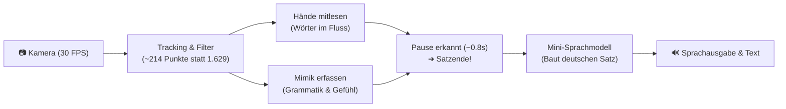

# Signy — Gebärdensprach-Übersetzer in Echtzeit

**Projektvorschlag (SYP4 / Diplomarbeit)**  
**Team:** 5 Personen | **Dauer:** 1,5 Jahre | **Stand:** September 2026  

---

## 1. Das Projekt auf den Punkt gebracht

**Signy** übersetzt Gebärdensprache per Kamera live in gesprochene und geschriebene deutsche Sätze. Über ein Mikrofon können Hörende antworten – ihr Gesprochenes wird als Text für die gehörlose Person angezeigt (**Zwei-Wege-Kommunikation**).

**Der Unterschied zu bisherigen Projekten:**  
In Gebärdensprache transportieren die Hände die Wörter, aber **das Gesicht macht die Grammatik**. Signy liest beides gleichzeitig aus: Handbewegungen für das Vokabular und Gesichtsmimik für Fragen, Verneinungen und Emotionen.

**Wie wird das Smartphone gehalten? (Ergonomie-Lösung):**  
Gebärdensprache braucht zwingend **beide Hände**. Daher gibt es zwei klare Szenarien:
1. **Theken-Modus (Hauptfokus):** Das Gerät steht in einer Halterung am Tisch/Schalter (Arzt, Amt, Kasse, Schule). Beide Hände sind frei.
2. **Partner-Modus (Unterwegs):** Der *hörende* Partner hält das Handy wie eine Kamera auf den Gehörlosen gerichtet (analog zu Google Translate). Der Gehörlose hat beide Hände frei zum Gebärden.

---

## 2. Warum nicht einfach eine Notizen-App nutzen?

Gehörlose Menschen hören oft: *„Tippt doch einfach ins Handy!“* Das scheitert im Alltag oft:
* **ÖGS ist die Muttersprache:** Für viele Gehörlose ist Deutsch eine Fremdsprache mit komplizierter Grammatik. Das Eintippen von deutschem Text ist anstrengend und unnatürlich.
* **Tempo:** Tippen schafft ca. **35 Wörter/Min.** – Gebärden läuft im normalen Sprechtempo mit **120–150 Wörter/Min.**
* **Gefühl & Tonfall:** Ein getippter Text wirkt steril. Die Mimik zeigt, ob etwas eine dringende Bitte, ein Scherz oder eine ernste Frage ist.
* **Zusatznutzen:** Signy funktioniert gleichzeitig als interaktiver Gebärdentrainer für hörende Eltern, Lehrkräfte oder Pflegepersonal.

---

## 3. Wie die Übersetzung funktioniert (Der Ablauf)

### Die 4 Schritte im Detail:

1. **Kamera & Daten-Diät (Pruning):**  
   Die Kamera filmt mit 30 Bildern pro Sekunde. Statt alle 543 Punkte von MediaPipe zu berechnen, filtern wir unwichtige Punkte (Wangen, Stirn) heraus. Wir behalten nur **42 Handpunkte**, **12 Körperhaltungspunkte** und **52 Gesichtsmuskel-Werte**.  
   *Effekt:* **87 % weniger Daten** – das System läuft flüssig und überhitzt das Gerät nicht.

2. **Wörter mitlesen & Pause erkennen (GAD):**  
   Solange sich die Hände bewegen, sammelt die KI einzelne Wörter im Zwischenspeicher (z. B. `[DU]`, `[MITKOMMEN]`). Ruhen die Hände für ca. 0,8 Sekunden, erkennt das System: *„Der Gedanke ist fertig – jetzt übersetzen!“*

3. **Das Gesicht bestimmt den Sinn (Non-Manual-Marker):**  
   Exakt dieselbe Handbewegung bedeutet völlig Verschiedenes, je nach Mimik:
   * 😐 **Neutrale Mimik:** `[DU] [MITKOMMEN]` ➔ *„Du kommst mit.“* (Aussage)
   * 🤨 **Augenbrauen hoch:** `[DU] [MITKOMMEN]` ➔ *„Kommst du mit?“* (Frage)
   * 🙅 **Kopfschütteln:** `[DU] [MITKOMMEN]` ➔ *„Du kommst **nicht** mit.“* (Verneinung – ohne Handzeichen für „nicht“!)
   * 🤩 **Lächeln & Freude:** `[DU] [MITKOMMEN]` ➔ *„Komm doch bitte mit!“* (Herzliche Einladung)

4. **Satzbau ohne Halluzinationen:**  
   Gebärdensprache hat keine Artikel („der/die/das“) und oft eine andere Wortstellung. Ein spezialisiertes Mini-Sprachmodell baut daraus einen korrekten deutschen Satz. Strenge Vorgaben (Temperatur $\le 0.2$) stellen sicher, dass die KI **keine Wörter erfindet**, die nie gebärdet wurden.

---

## 4. Der realistische Daten-Plan für Österreich (ÖGS)

Österreichische Gebärdensprache (ÖGS) ist **nicht** identisch mit deutscher (DGS) oder amerikanischer (ASL) Gebärdensprache. Es gibt jedoch kaum fertige ÖGS-Daten. 

**Unser 2-Stufen-Plan:**
1. **Stufe 1 (Technik testen):** Wir trainieren die Erkennung zuerst mit großen öffentlichen Datensätzen (ASL/DGS). So stellen wir sicher, dass die Software flüssig mit 30 FPS läuft.
2. **Stufe 2 (ÖGS-Kernwortschatz):** Wir versuchen nicht, 10.000 Wörter zu lernen. Wir konzentrieren uns auf **30–50 lebenswichtige Begriffe** (Medizin, Notfall, Orientierung: *Hilfe, Schmerz, Arzt, Wo, Wann, Allergie, Ja, Nein*).  
   *Aufnahme-Rechnung:* 5 Teammitglieder $\times$ 50 Wörter $\times$ 10 Wiederholungen = **2.500 Video-Clips**. Durch Spiegelung, Zoomen und Tempo-Variationen erzeugen wir daraus **über 10.000 Trainingsbeispiele**.

---

## 5. Notfallplan für die Matura (Die „Kill-List“)

Sollte die Zeit im Schuljahr knapp werden, greift ein klarer Rettungsplan, damit am Ende eine **garantiert funktionierende Live-Demo** auf der Bühne steht:

| Wenn das Problem auftritt... | ...dann streichen wir das: | Unser sicherer Plan B: |
| :--- | :--- | :--- |
| **Mobile App macht Zicken** | Native Smartphone-App (iOS/Android) | Wir bleiben bei der **Web-App (PWA)**. Läuft auf jedem Laptop/Handy-Browser fehlerfrei. |
| **ÖGS-Daten reichen nicht** | Großes Vokabular | Wir reduzieren auf **20–30 perfekte Wörter**. 30 fehlerfreie Wörter überzeugen mehr als 500 fehlerhafte. |
| **Eigenes Sprachmodell zu lahm** | Aufwendiges Modell-Training von Hand | Wir nutzen eine schlanke Cloud-KI (z. B. Gemini Flash) mit strikten Anti-Halluzinations-Regeln. |

---

## 6. Technologie-Stack & Tempo-Check

Damit nichts ruckelt, muss ein Bild in unter **33 Millisekunden** (30 FPS) verarbeitet sein:

| Schritt | Dauer | Technologie |
| :--- | :--- | :--- |
| 1. Bild von Kamera laden | ~2 ms | WebRTC (VGA-Auflösung $640 \times 480$) |
| 2. Hände & Gesicht tracken | ~13 ms | MediaPipe Tasks (GPU-beschleunigt) |
| 3. Daten filtern & Geschwindigkeit messen | ~1 ms | Eigener Python/TypeScript-Code |
| 4. Gebärde & Mimik erkennen | ~4 ms | Schlankes Transformer-Modell + Blendshape-MLP |
| 5. Benutzeroberfläche zeichnen | ~6 ms | React (Web App) |
| **Gesamtzeit pro Bild** | **~26 ms** | **Flüssige 30 FPS gesichert** |

---

## 7. Team & Meilensteine (5 Personen, 1,5 Jahre)

* **Person 1 & 2 (Vision & Data (ÖGS)):** MediaPipe Kamera-Pipeline, Daten-Diät (Pruning), Tempo-Optimierung. Videoaufnahmen der 50 ÖGS-Gebärden, Datenvervielfachung (Augmentation).
* **Person 3 & 4 (KI & Gesten / NLP & Mimik):** Neuronales Netz für Handbewegungen, Pause-Erkennung (GAD). Gesichtsmuskel-Auswertung (Frage/Verneinung), Satzbau-KI, Spracheingabe für Hörende.
* **Person 5 (Frontend & App):** React-Benutzeroberfläche, Audio-Ausgabe, Tests.

### Zeitplan in 5 klaren Schritten:
1. **Monat 1–6:** Kamera & Tracking im Browser zum Laufen bringen (30 FPS).
2. **Monat 6–10:** Gesichtserkennung anbinden (Unterscheidung Aussage vs. Frage vs. Verneinung).
3. **Monat 10–12:** Erste 30 Test-Gebärden stabil erkennen + Pause-Trigger einbauen.
4. **Monat 12–14:** Eigene ÖGS-Videos aufnehmen & Satzgenerator fertigstellen.
5. **Monat 15–18:** Praxistests, Fehlerbehebung, Vorbereitung.
