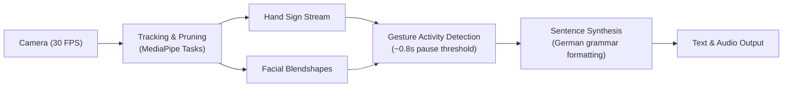

# Signy

Real-time Austrian Sign Language (ÖGS) translation system providing bidirectional communication between deaf and hearing users.

Signy tracks hand gestures and facial expressions simultaneously using computer vision. Captured signs are mapped to text and speech, while spoken responses from hearing partners are transcribed back to text.

## Features

- **Multimodal recognition:** Captures hand positions for vocabulary and facial expressions / head tilt for grammar (questions, negation, emphasis).
- **Bidirectional communication:**
  - Deaf to hearing: Camera input -> sign recognition -> sentence generation -> text/TTS output.
  - Hearing to deaf: Microphone input -> speech-to-text -> on-screen display.
- **Form factors:**
  - Counter mode: Stationary mount for service desks, healthcare, and classrooms.
  - Partner mode: Mobile device held by hearing conversation partner.
- **Landmark pruning:** Reduces MediaPipe tracking data down to 42 hand points, 12 pose points, and 52 facial blendshape coefficients to maintain 30 FPS processing on consumer hardware.

## Architecture



### Pipeline Overview

1. **Input & Tracking:** 640x480 video captured at 30 FPS via WebRTC. Landmark tracking extracts essential hand, upper-body pose, and facial blendshapes.
2. **Gesture Activity Detection (GAD):** Movements are buffered as tokens. A resting pause (~0.8 seconds) triggers sentence segmentation.
3. **Non-Manual Marker (NMM) Analysis:** Head orientation and facial blendshapes determine statement type (affirmation, question, negation).
4. **Sentence Construction:** Translates token sequences into grammatically complete German sentences using constrained decoding to prevent hallucinated content.

## Tech Stack

- **Application:** React (PWA)
- **Computer Vision:** MediaPipe Tasks, WebRTC
- **Inference:** Transformer sequence model, Blendshape MLP
- **Language / Audio:** Lightweight NLP model, Web Speech API / TTS

## Repository Layout

- `docs/` - Project proposal, specifications, and architecture notes
- `openspec/` - Change proposals and specifications
- `pitch/` - Project presentation slides (`pitch.html`)
- `prompts/` - Team backlog configurations and task templates

## Pitch Presentation

The project presentation is located in `pitch/`. Run locally:

```bash
./pitch/start_presentation.sh
```

Or start a local HTTP server manually:

```bash
python3 -m http.server 8080
```

Navigate to `http://localhost:8080/pitch/pitch.html`.
